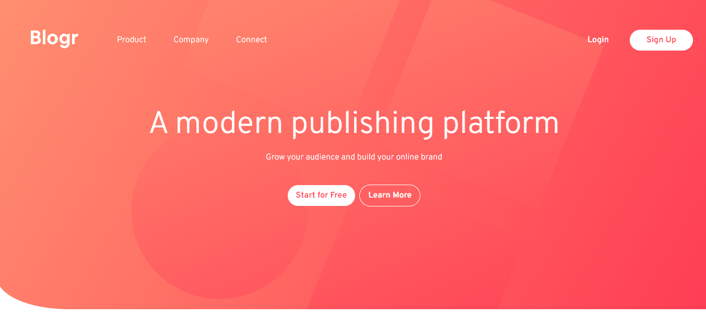

# Blogr Landing Page

This is a landing page made with React for Blogr Website.

**Link to project:** https://blogr-facundo.netlify.app/

## How It's Made:

**Tech used:**

- React
- [Vite.JS](https://vitejs.dev/)
- Tailwind CSS

## Optimizations

Future optimizations are adding Framer Motion for smooth transitions when first showing the page.

## Lessons Learned:

Building this page was a challenge, managing the z-index of different images and styles was difficult but I love the result. I look forward to build more frontend websites!

## Examples:

Take a look at these couple examples that I have in my own portfolio:

**Preview Card Component:** https://github.com/facuperezm/-3-column-preview-card-component

**Advice Generator:** https://github.com/facuperezm/advice-generator

**Cute Dogs:** https://github.com/facuperezm/cutedogs
